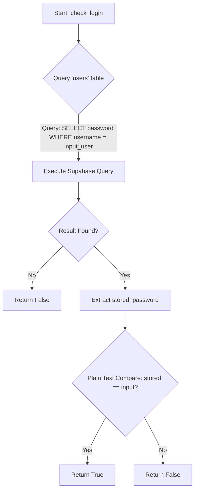

# 📘 JugnooCRM: Comprehensive System Documentation

**Version:** 2.0.1 (Unified Master)
**Scope:** User Guide (L3) & System Architecture (L4)

---

# PART 1: User Guide & Feature Reference (L3)

## 1. Introduction
JugnooCRM is a specialized Customer Relationship Management tool designed for managing client estimates, inventory, and project financials. It is built on a modern tech stack using **Streamlit** for the frontend and **Supabase** (PostgreSQL) for the backend.

## 2. User Interface & Features

### Tab 1: Dashboard
The command center of the application.
*   **Client List**: View all active clients. Filter by "Active", "Closed", or "All".
*   **Summary Metrics**: Real-time overview of "Total Clients", "Active Projects", and "Completion Rate".
*   **Recent Activity**: Feed of the 5 most recent client updates.
*   **Top Clients**: Leaderboard of top 5 clients by estimated value.
*   **Quick Actions**:
    *   **Call**: Click the phone number to initiate a call (mobile only).
    *   **Map**: Click the address link to open Google Maps.
    *   **Edit**: Expand any client card to update details or change status.
*   **Manage Estimate**: A dedicated section within each client card to add/edit estimate items.

### Tab 2: New Client
*   **Geolocation**: Use the "Get Location" button to auto-fetch GPS coordinates.
*   **Validation**: Phone numbers are strictly validated (digits, spaces, +, - only).
*   **Required Fields**: The system enforces mandatory entry for Client Name, Phone Number, and Address. Incomplete forms cannot be submitted.

### Tab 3: Estimator Engine
The core tool for generating quotes.
*   **Custom Margins**: Override global default margins for specific clients.
*   **Real-time Calculation**: Costs, selling prices, and profits update instantly as you add items.
*   **Stock Warnings**: Alerts you if the estimated quantity exceeds available inventory.
*   **Auto-Restock**: If stock is insufficient, a "Place Order for Missing Items" button appears, adding the deficit to the Restock Queue in the Suppliers tab.
*   **PDF Generation**: One-click generation of "Client Invoice" (clean) or "Internal Report" (detailed).

### Tab 4: Inventory Management
*   **Live Editor**: Update stock levels or base rates directly in the table.
*   **Overview Metrics**: "Total Items", "Total Inventory Value", and "Low Stock" alerts.
*   **Unit Support**: Supports `pcs`, `m`, `ft`, `cm`, `in` with auto-conversion.
*   **Stock Enforcement**: Strict integer enforcement for `pcs` items (e.g., you cannot have 1.5 pcs). Other units allow decimal precision.
*   **Data Integrity**: Specific handling for complex item names (e.g., "128 GB SATA SSD") ensures that unit parsing logic remains robust and doesn't accidentally truncate item descriptions.

### Tab 5: Suppliers & Purchasing
*   **Purchase Log**: Record new stock purchases.
*   **Restock Queue**: A holding area for items flagged as "Low Stock" from the Estimator. Allows batch ordering from suppliers.
*   **Overview Metrics**: "Total Suppliers", "Total Spend", and "Top Suppliers" by spend.
*   **Auto-Update**: Automatically updates inventory stock and recalculates the **Base Rate** based on the latest purchase price.

### Tab 6: Financials (P&L)
*   **Global Cash Flow**: Tracks actual money in (Total Collected) vs money out (Total Expenses), providing a "Net Cash Profit" view.
*   **Project Profitability**: Analyzes profitability per project based on Estimated Costs vs Actual Revenue.
*   **Business Health**: View Total Collected vs. Total Expenses.
*   **Outstanding Amount**: Tracks the gap between quoted and collected amounts.
*   **Visual Analysis**: 7 Distinct Charts:
    1.  **Revenue vs Expenses vs Payment** (Bar - Plotly)
    2.  **Global Cost Split** (Pie - Plotly)
    3.  **Client Profitability Matrix** (Scatter - Altair)
    4.  **Monthly Performance** (Combo Bar+Line - Altair)
    5.  **Client Profitability** (Line - Altair)
    6.  **Monthly Performance Trend** (Line - Altair)
    7.  **Business Health Scorecard** (Radar - Plotly) - Visualizes Revenue Capture, Profit Margin, Cost Efficiency, and Labor Cost %.

### Tab 7: Settings
*   **Global Defaults**: Set standard margins for Parts, Labor, and Extra overheads.
*   **Labor Cost**: Define the daily cost per laborer.
*   **Global Defaults**: Set standard margins for Parts, Labor, and Extra overheads.
*   **Labor Cost**: Define the daily cost per laborer.
*   **Advance Config**: Set the global "Advance Profit Margin %". Includes an interactive calculator preview.
*   **Manage Staff Roles**: Add new roles to the system dynamically (e.g., "Senior Technician").

### Tab 8: Staff Management
*   **Team Roster**: View all staff members, their roles, phone numbers, and current status.
*   **Status Tracking**: Staff status updates automatically based on project assignment (`Available` -> `On Site`).
*   **Registration**: Add new staff members with specific roles and daily wage rates.

---

## 3. Field-by-Field Reference

### Login Screen
| Field Label | Type | Constraints | Purpose |
| :--- | :--- | :--- | :--- |
| **Username** | Text Input | None | Enter login username. |
| **Password** | Password Input | Masked | Enter login password. |

### Tab 1: Dashboard
| Section | Field Label | Type | Constraints | Purpose |
| :--- | :--- | :--- | :--- | :--- |
| **Filters** | **Show** | Radio | `Active`, `All`, `Closed` | Filter the client list by project status. |
| **Edit Details** | **Name** | Text Input | None | Edit client's full name. |
| **Edit Details** | **Phone** | Text Input | Max 15 chars | Edit phone number. Validated to allow only digits, spaces, `+`, `-`. |
| **Edit Details** | **Address** | Text Area | None | Edit full billing/site address. |
| **Edit Details** | **Maps Link** | Text Input | None | Edit Google Maps URL. |
| **Project Status** | **Status** | Selectbox | List of Statuses | Change current project stage (e.g., `Order Received`). |
| **Project Status** | **Start Date** | Date Input | Date | Set/Update project start date. Defaults to existing date or Today. |
| **Payment** | **Final Amount Received** | Number Input | Min 0, Step 100 | Record final settlement. Defaults to rounded Grand Total. |
| **Manage Estimate** | **Data Editor** | Table | Dynamic Rows | Edit `Qty` (Step 0.1) and `Base Rate`. `Item` name is editable. |

### Tab 2: New Client
| Field Label | Type | Constraints | Purpose |
| :--- | :--- | :--- | :--- |
| **Client Name** | Text Input | None | Name of the new client. |
| **Phone** | Text Input | Max 15 chars | Contact number. Validated for digits/symbols. |
| **Address** | Text Area | None | Physical address for the project. |
| **Google Maps Link** | Text Input | None | URL for location. Can be auto-filled via "Paste Location" button. |

### Tab 3: Estimator
| Section | Field Label | Type | Constraints | Purpose |
| :--- | :--- | :--- | :--- | :--- |
| **Header** | **Select Client** | Selectbox | Active Clients | Choose which client to estimate for. |
| **Config** | **Use Custom Margins** | Checkbox | Boolean | Enable sliders to override global margin defaults. |
| **Config** | **Days** | Number Input | Min 1, Step 1 | Estimated labor days required. |
| **Config** | **Part %** | Slider | 0-100 | Override Material Margin (if Custom enabled). |
| **Config** | **Labor %** | Slider | 0-100 | Override Labor Margin (if Custom enabled). |
| **Config** | **Extra %** | Slider | 0-100 | Override Extra Margin (if Custom enabled). |
| **Add Items** | **Item** | Selectbox | Inventory Items | Select item to add to estimate. |
| **Add Items** | **Qty** | Number Input | Min 0.1, Step varies | Quantity to add. Step is 1.0 for `pcs`, 0.1 for others. |
| **Table** | **Data Editor** | Table | Dynamic Rows | Modify `Qty` and `Base Rate` of added items. |

### Tab 4: Inventory
| Section | Field Label | Type | Constraints | Purpose |
| :--- | :--- | :--- | :--- | :--- |
| **Add Item** | **Item Name** | Text Input | None | Name of new inventory item. |
| **Add Item** | **Base Rate (₹)** | Number Input | Min 0.0, Step 0.1 | Cost price per unit. |
| **Add Item** | **Unit** | Selectbox | `pcs`, `m`, `ft`, `cm`, `in` | Unit of measurement. |
| **List** | **Data Editor** | Table | Dynamic Rows | Quick-edit `Stock`, `Base Rate`, or `Unit`. |
| **Manage** | **Select Item** | Selectbox | Existing Items | Select item to edit/delete. |
| **Manage** | **Name** | Text Input | None | Rename item. |
| **Manage** | **Base Rate** | Number Input | Float | Update cost price. |
| **Manage** | **Stock** | Number Input | Float | Manually adjust stock level. |
| **Manage** | **Unit** | Selectbox | Units List | Change unit type. |

### Tab 5: Suppliers
| Section | Field Label | Type | Constraints | Purpose |
| :--- | :--- | :--- | :--- | :--- |
| **Record Purchase** | **Supplier** | Selectbox | Suppliers List | Select source of purchase. |
| **Record Purchase** | **Item** | Selectbox | Inventory List | Select item purchased. |
| **Record Purchase** | **Quantity Purchased** | Number Input | Min 1.0, Step 1.0 | Amount to add to stock. |
| **Record Purchase** | **Purchase Rate** | Number Input | Min 0.0, Step 0.1 | New cost price (updates Base Rate). |

### Tab 7: Settings
| Section | Field Label | Type | Constraints | Purpose |
| :--- | :--- | :--- | :--- | :--- |
| **Global** | **Default Parts Margin (%)** | Number Input | Int | Default margin for materials. |
| **Global** | **Default Labor Margin (%)** | Number Input | Int | Default margin for labor. |
| **Global** | **Default Extra Margin (%)** | Number Input | Int | Default overhead margin. |
| **Global** | **Daily Labor Cost (₹)** | Number Input | Float | Cost per labor day (e.g., 1000). |
| **Calculator** | **Total Estimate Value (₹)** | Number Input | Min 0, Step 1000 | Input for quick advance calculation. |
| **Calculator** | **Advance Percentage** | Slider | 0-100 | Percentage to calculate advance. |

---
---

# PART 2: System Architecture & Engineering Manual (L4)

## 4. System Core & Insecure Authentication Architecture

### 4.1 Global Configuration & Dependencies

The application relies on a specific set of libraries defined in `requirements.txt`.

| Dependency | Purpose | Usage Context |
| :--- | :--- | :--- |
| `streamlit` | Core UI Framework | Renders the entire frontend and manages session state. |
| `supabase` | Database Client | `supabase-py` client for PostgreSQL interactions. |
| `pandas` | Data Manipulation | Used for client filtering, inventory management, and P&L calculations. |
| `fpdf` | PDF Generation | Generates pixel-perfect Invoices and Internal Reports (`utils/helpers.py`). |
| `extra-streamlit-components` | Cookie Management | Manages persistent authentication cookies (`CookieManager`). |
| `streamlit-js-eval` | Geolocation | Bridges Python and JS to fetch browser GPS coordinates. |
| `altair` | Data Visualization | Renders P&L charts (Revenue vs Expenses). |
| `plotly` | Data Visualization | Renders complex P&L charts (Pie, Radar) for better interactivity. |

**Global Constants (`utils/helpers.py`)**
To prevent "magic numbers" and ensure consistency, the following constants are defined:

*   `CONVERSIONS`: Normalizes all length units to **meters**.
    *   `pcs`: 1.0, `each`: 1.0, `m`: 1.0
    *   `cm`: 0.01, `ft`: 0.3048, `in`: 0.0254
*   `ACTIVE_STATUSES`: `["Estimate Given", "Order Received", "Work In Progress"]` - Defines which clients appear in the "Active" filter.
*   `P_L_STATUS`: `["Work Done", "Closed"]` - Defines which projects contribute to the Profit & Loss statement.

### 4.2 Authentication Flow Control (Critique & Mapping)

> [!CAUTION]
> **Security Critical Review**: The current authentication implementation contains a severe vulnerability.

**Vulnerability Analysis**:
The function `check_login` in `app.py` (Line 42) performs a **Plain Text Password Comparison**.
*   **Risk**: If the database is compromised, all user passwords are exposed.
*   **Offending Line**: `return res.data[0]['password'] == password`
*   **Remediation**: Must implement hashing (e.g., `bcrypt` or `Argon2`) immediately.

**Pseudocode Flowchart: `check_login(username, password)`**



**Connection Cache Mechanism**
Streamlit's execution model reloads the script on every interaction. To prevent re-establishing the database connection (which is slow and resource-intensive) on every rerun:

1.  **Decorator**: `@st.cache_resource(ttl="1h")` is applied to `init_connection()`.
2.  **Behavior**:
    *   **First Run**: The function executes, creates the `Client` object, and stores it in memory.
    *   **Subsequent Runs**: Streamlit returns the *existing* object from memory.
    *   **TTL (Time To Live)**: The cache expires after 1 hour, forcing a fresh connection to handle potential token timeouts or stale sockets.

---


## 5. Debugging Architecture

### 5.1 Runtime HUD (Heads Up Display)
For advanced debugging, the application supports a runtime HUD injected via JavaScript.

*   **Mechanism**: The HUD is injected into the DOM using `st.components.v1.html` or direct JS injection.
*   **Purpose**:
    *   **State Visualization**: Displays critical session state variables (e.g., current user, active client ID) overlaying the UI.
    *   **Action Triggers**: Allows developers to trigger specific backend states or reset data without navigating the full UI.
    *   **Console Logging**: Bridges Python-side events to the browser console for easier tracing.

---

## 6. Estimator Engine: Margin & Financial Modeling

### 6.1 Unit Normalization & Conversion Logic

The system normalizes all linear measurements to a base unit of **1.0** (equivalent to meters or pieces) before applying costs. This ensures that a user entering "10 feet" is charged correctly relative to the base rate defined in meters.

**Data Structure Mapping: Input $\rightarrow$ Calculation**

| User Input (UI) | Internal Key | Transformation Logic | Example |
| :--- | :--- | :--- | :--- |
| **Qty** | `Qty` | `float(input)` | `10` |
| **Unit** | `Unit` | `CONVERSIONS.get(input, 1.0)` | `ft` $\rightarrow$ `0.3048` |
| **Base Rate** | `Base Rate` | `float(input)` | `100` (Cost per meter) |

**Calculation**:
$$ \text{Effective Qty} = \text{Qty} \times \text{Conversion Factor} $$
$$ 10 \text{ ft} \times 0.3048 = 3.048 \text{ effective units} $$

### 6.2 Financial Formulas

All financial calculations are centralized in `utils.helpers.calculate_estimate_details`.

**A. Material Selling Multiplier ($M_m$)**
Derived from the sum of all applicable margins.
$$ M_m = 1 + \frac{\text{Part \%}}{100} + \frac{\text{Labor \%}}{100} + \frac{\text{Extra \%}}{100} $$

**B. Total Profit Equation**
The system enforces a "Round Up to Nearest 100" rule for the Grand Total. The difference between the raw calculated cost and the rounded total is treated as **pure profit**.

$$ \text{Raw Total} = (\sum (\text{Base Cost} \times M_m)) + \text{Labor Cost} $$
$$ \text{Grand Total} = \lceil \frac{\text{Raw Total}}{100} \rceil \times 100 $$
$$ \text{Total Profit} = \text{Grand Total} - (\text{Total Base Cost} + \text{Labor Cost}) $$

**C. Advance Payment Formula**
The advance is calculated to cover the base cost plus a 10% profit buffer, also rounded up to the nearest 100.

$$ \text{Advance} = \lceil \frac{\text{Total Base Cost} + (0.10 \times \text{Total Profit})}{100} \rceil \times 100 $$

### 6.3 Estimate Data Persistence

The estimate data is stored in the `clients` table within the `internal_estimate` column. This is a **JSONB** column in PostgreSQL.

**Schema: `internal_estimate` (List of Objects)**

| Key | Data Type | Description | Default |
| :--- | :--- | :--- | :--- |
| `Item` | String | Name of the inventory item. | `""` |
| `Qty` | Float | Quantity required. | `0.0` |
| `Unit` | String | Unit of measurement (`m`, `ft`, `pcs`). | `"pcs"` |
| `Base Rate` | Float | Cost price per unit. | `0.0` |
| `Unit Price` | Float | Calculated selling price per unit. | `0.0` |
| `Total Price` | Float | `Qty` $\times$ `Unit Price`. | `0.0` |

---

## 7. Data Structure & State Mapping

### 7.1 PostgreSQL Schema Mapping

This table maps critical UI fields to their underlying database columns, providing a definitive reference for data types and constraints.

**Table: `clients`**

| Application Field (UI Label) | PostgreSQL Column | Data Type | Constraint / Usage |
| :--- | :--- | :--- | :--- |
| **Client Name** | `name` | `TEXT` | Primary display name. |
| **Phone** | `phone` | `TEXT` | Validated via Regex (Digits, space, +, -). |
| **Address** | `address` | `TEXT` | Full billing/site address. |
| **Status** | `status` | `TEXT` | Enum-like: `Estimate Given`, `Work Done`, etc. |
| **Start Date** | `start_date` | `DATE` | Project commencement date. |
| **(Hidden)** | `internal_estimate` | `JSONB` | Stores the list of estimate items (See Section 2.3). |
| **Final Amount Received** | `final_settlement_amount` | `NUMERIC` | Actual cash collected. Used for P&L "Revenue". |
| **Assigned Staff** | `assigned_staff` | `JSONB` | List of Staff IDs assigned to the project. |

**Table: `staff`**

| Application Field (UI Label) | PostgreSQL Column | Data Type | Constraint / Usage |
| :--- | :--- | :--- | :--- |
| **Full Name** | `name` | `TEXT` | Not Null. |
| **Role** | `role` | `TEXT` | Not Null. |
| **Phone Number** | `phone` | `TEXT` | |
| **Daily Wage** | `salary` | `NUMERIC` | Default 0. Mapped from UI 'Daily Wage'. |
| **Status** | `status` | `TEXT` | Default 'Available'. Options: 'Available', 'On Site'. |

**Table: `staff_roles`**

| Application Field (UI Label) | PostgreSQL Column | Data Type | Constraint / Usage |
| :--- | :--- | :--- | :--- |
| **Role Name** | `role_name` | `TEXT` | Primary Key. Name of the role (e.g., Manager). |

**Table: `staff`**

| Application Field (UI Label) | PostgreSQL Column | Data Type | Constraint / Usage |
| :--- | :--- | :--- | :--- |
| **Full Name** | `name` | `TEXT` | Not Null. |
| **Role** | `role` | `TEXT` | Not Null. |
| **Phone Number** | `phone` | `TEXT` | |
| **Daily Wage** | `salary` | `NUMERIC` | Default 0. Mapped from UI 'Daily Wage'. |
| **Status** | `status` | `TEXT` | Default 'Available'. Options: 'Available', 'On Site'. |

**Table: `staff_roles`**

| Application Field (UI Label) | PostgreSQL Column | Data Type | Constraint / Usage |
| :--- | :--- | :--- | :--- |
| **Role Name** | `role_name` | `TEXT` | Primary Key. Name of the role (e.g., Manager). |

**Table: `inventory`**

| Application Field (UI Label) | PostgreSQL Column | Data Type | Constraint / Usage |
| :--- | :--- | :--- | :--- |
| **Item Name** | `item_name` | `TEXT` | Unique identifier for stock items. |
| **Base Rate** | `base_rate` | `NUMERIC` | Cost price per unit. Updated on purchase. |
| **Stock** | `stock_quantity` | `NUMERIC` | Current available quantity. |
| **Unit** | `unit` | `TEXT` | `pcs`, `m`, `ft`, `cm`, `in`. |

**Table: `supplier_purchases`**

| Application Field (UI Label) | PostgreSQL Column | Data Type | Constraint / Usage |
| :--- | :--- | :--- | :--- |
| **Supplier** | `supplier_id` | `BIGINT` | FK to `suppliers.id`. |
| **Item Name** | `item_name` | `TEXT` | Name of item purchased. |
| **Quantity** | `quantity` | `NUMERIC` | Amount purchased. |
| **Cost** | `cost` | `NUMERIC` | Total cost of purchase. |
| **Date** | `purchase_date` | `DATE` | Date of transaction. |
| **Notes** | `notes` | `TEXT` | Optional remarks. |

### 7.2 Streamlit Session State Lifecycle

Streamlit's state management is crucial for the "Manage Estimate" feature, which requires temporary persistence before saving to the DB.

**Lifecycle: Estimate Editing (`st.session_state.est_{client_id}`)**

1.  **Initialization**:
    *   Trigger: User expands "Manage Estimate" for Client X.
    *   Action: System checks if `est_{client_id}` exists. If not, it loads data from `client['internal_estimate']` into Session State.
2.  **Modification**:
    *   Trigger: User edits cells in `st.data_editor`.
    *   Action: The `data_editor` widget directly updates the list in Session State.
3.  **Persistence (Commit)**:
    *   Trigger: User clicks "Save Estimate Changes".
    *   Action: The current state of `est_{client_id}` is serialized to JSON and sent to Supabase: `supabase.table("clients").update(...)`.
4.  **Cleanup**:
    *   Action: `del st.session_state[f"est_{client_id}"]` (Optional, but good practice to prevent stale data on re-fetch).

---

## 8. Operational and Reporting Logic

### 8.1 Stock Validation Pseudocode

The system validates stock availability in real-time within the Estimator.

```mermaid
graph TD
    A[Start: Estimate Calculation] --> B[Iterate through Estimate Items]
    B --> C{Item in Inventory?}
    C -- No --> D[Skip / Warning]
    C -- Yes --> E[Fetch Available Stock]
    E --> F{Estimate Qty > Available Stock?}
    F -- Yes --> G[Add to Missing Items List]
    F -- No --> H[Continue]
    H --> I{More Items?}
    I -- Yes --> B
    I -- No --> J{Missing List Empty?}
    J -- Yes --> K[Show Success / Ready]
    J -- No --> L[Trigger st.error Alert]
    L --> M[Show 'Place Order' Button]
    M --> N[Add to Restock Queue (Session State)]
```

### 8.2 Purchase Log & Inventory Update Synchronization

Recording a purchase involves a **Dual-Write Operation** to ensure auditability and state consistency.

**Step 1: Transaction Logging**
A record is inserted into `purchase_log` to create an immutable history.
*   Fields: `supplier_id`, `item_name`, `qty`, `rate`, `total_cost`.

**Step 2: Inventory State Update**
The `inventory` table is updated to reflect the new reality.
*   **Stock Logic**: `New Stock = Old Stock + Purchased Qty`
*   **Rate Logic**: `New Base Rate = Purchase Rate` (The system assumes FIFO/LIFO is too complex; it simply overwrites the current replacement cost).

**Pseudocode:**
```python
def record_purchase(item, qty, rate):
    # 1. Log Transaction
    supabase.table("purchase_log").insert({
        "supplier_id": item.supplier_id,
        "item_name": item.name,
        "qty": qty,
        "rate": rate,
        "total_cost": qty * rate
    }).execute()
    
    # 2. Update Inventory
    current_stock = get_current_stock(item)
    supabase.table("inventory").update({
        "stock_quantity": current_stock + qty,
        "base_rate": rate
    }).eq("id", item.id).execute()
```

### 8.3 PDF Generation Data Flow

The transition from UI Data to PDF Output involves a specific transformation pipeline.

1.  **Source**: `st.data_editor` (Pandas DataFrame).
2.  **Transformation**:
    *   `df.to_dict('records')` converts the DataFrame into a list of dictionaries.
    *   **Sanitization**: `NaN` values are converted to `0.0` or empty strings.
3.  **Injection**:
    *   The list of dicts is passed to `PDFGenerator.generate_client_invoice`.
4.  **Rendering**:
    *   `FPDF` iterates through the list, drawing cells for `Item`, `Qty`, `Unit`, and `Total Price`.
    *   **Layout**: The PDF engine calculates page breaks automatically based on row height.

---
**End of Comprehensive Documentation**

---

## 9. Aesthetics & UI Implementation Details 🎨

### 9.1 Streamlit Style Injection

**Source**: `app.py` (Lines 33-57)
The application enforces a custom "Dark Mode" theme by injecting raw CSS via `st.markdown`.

```css
<style>
/* Main App Background - Deep Dark Blue/Black */
.stApp { background-color: #0E1117 !important; }
header[data-testid="stHeader"] { background-color: #0E1117 !important; }
[data-testid="stAppViewContainer"] { background-color: #0e1117; }
[data-testid="stSidebar"] { background-color: #0e1117; }
html, body { background-color: #0E1117; height: 100%; margin: 0; }

/* Hide Default Streamlit Elements */
#MainMenu { visibility: hidden; }
footer { visibility: hidden; }

/* Custom Metric Card Styling */
[data-testid="stMetric"] {
    background-color: #262730; /* Lighter gray for contrast */
    border: 1px solid #464b5f; /* Subtle border */
    padding: 15px;
    border-radius: 8px; /* Rounded corners */
    color: white;
}
[data-testid="stMetricLabel"] { color: #b4b4b4; } /* Muted text for labels */
</style>
```

**Aesthetic Analysis**:
*   **#0E1117**: The primary background color, creating a unified, immersive dark theme that overrides Streamlit's defaults.
*   **#262730**: Used for cards (Metrics), providing depth and separation from the background.
*   **#464b5f**: A subtle border color that defines the edges of UI elements without being distracting.

### 9.2 Component Appearance Map

| Component | Selector (CSS) | Property : Value | Resulting Aesthetic |
| :--- | :--- | :--- | :--- |
| **App/Header Background** | `.stApp`, `header` | `background-color: #0E1117` | Seamless dark theme base. |
| **Metric Cards** | `[data-testid="stMetric"]` | `background-color: #262730` | Elevated "card" look with contrast. |
| **Metric Cards** | `[data-testid="stMetric"]` | `border-radius: 8px` | Modern, soft edges. |
| **Metric Labels** | `[data-testid="stMetricLabel"]` | `color: #b4b4b4` | De-emphasized text for visual hierarchy. |
| **System Menu** | `#MainMenu`, `footer` | `visibility: hidden` | Clean, "App-like" interface (no "Made with Streamlit"). |

---

## 10. PDF Layout Specification ($\text{fpdf}$ Mechanics) 📄

### 10.1 Global PDF Layout Constants

**Source**: `utils/helpers.py` (`PDFGenerator` class)

| Context | Property | Value | Description |
| :--- | :--- | :--- | :--- |
| **Header Font (Primary)** | Font | `"Arial", 'B', 20` | Main title "**Jugnoo**". |
| **Header Font (Secondary)** | Font | `"Arial", 'I', 10` | Subtitle "*Smart Automation Solutions*". |
| **Header Separator** | Line | `X1: 10, Y: 28, X2: 200` | Horizontal line below header. |
| **Document Title** | Font | `"Arial", 'B', 12` | e.g., "**Estimate For: Client X**". |
| **Date Stamp** | Font | `"Arial", '', 10` | Standard text. |
| **Table Header Fill** | Color | `(240, 240, 240)` | Light gray background for headers. |

### 10.2 Invoice Cell and Alignment Matrix

**Source**: `generate_client_invoice` method.
The table is rendered using a strict grid system.

| Column | Width (Units) | Font Style | Alignment | Filling | Description |
| :--- | :--- | :--- | :--- | :--- | :--- |
| **Description** | `100` | **BOLD** (Header) | Left (L) | Filled (1) | Item Name. |
| **Qty** | `15` | **BOLD** (Header) | Center (C) | Filled (1) | Quantity. |
| **Unit** | `15` | **BOLD** (Header) | Center (C) | Filled (1) | Unit type. |
| **Amount (INR)** | `60` | **BOLD** (Header) | Right (R) | Filled (1) | Total Price. |

**Row Rendering**:
*   **Font**: `"Arial", '', 10` (Regular).
*   **Dimensions**: Matches header widths exactly.
*   **Labor Line**:
    *   Label: Width `130`, Align `R` ("Labor / Installation...").
    *   Value: Width `60`, Align `R`.
*   **Grand Total**:
    *   Font: `"Arial", 'B', 12`.
    *   Label: Width `130`, Align `R`.
    *   Value: Width `60`, Align `R`.

---
**End of Comprehensive Documentation (L5 Augmented)**
